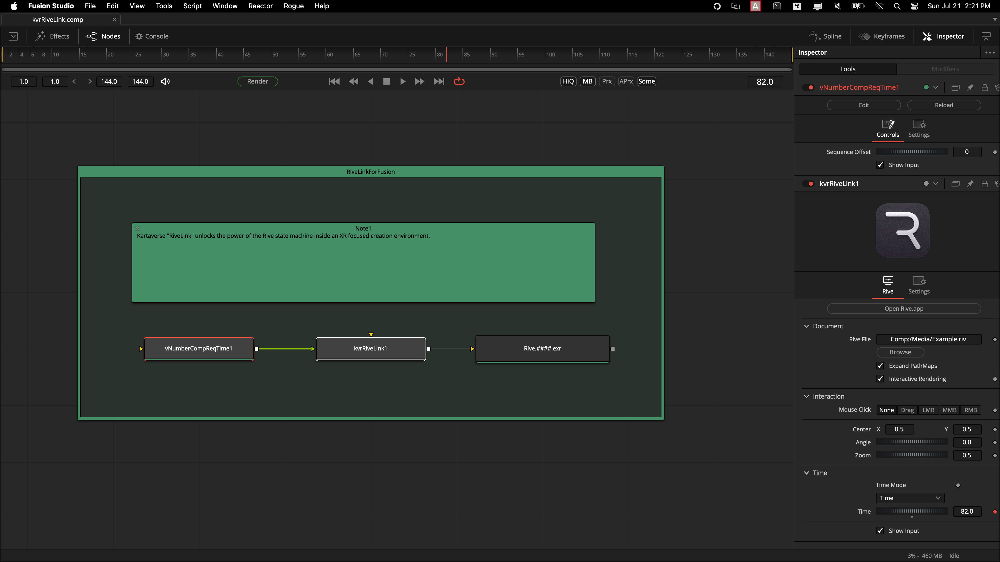
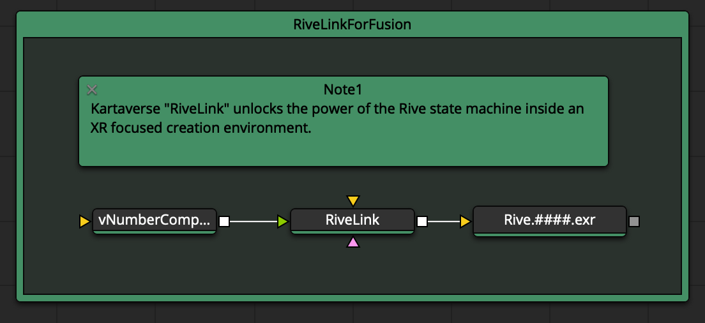

# RiveLink - v5.73 2024-07-21
By Andrew Hazelden <andrew@andrewhazelden.com>

## Overview

> The ultimate XR motion graphics solution for Fusioneers
> Enjoy!
>

Welcome to the development repo for "RiveLink" — a [Rive.app](https://rive.app/) integration plugin for BMD Resolve/Fusion.

With RiveLink you can effortlessly port your existing Rive.app created motion graphics so they can work inside your favorite node based compositing toolset.

___

Using the toolset is as easy as adding a RiveLink node to your comp. 

With only three nodes in your Fusion comp you are ready to output Rive.app animations to disk that are rendered at real-time FPS.

---

The RiveLink node is implemented as a cross-platform compatible fuse node that uses LuaJIJT FFI shared library linking to the official [rive-cpp](https://github.com/rive-app/rive-cpp) library.

## Open Source Software License

- LGPL 3.0 License

## Usage

Step 1. Add a RiveLink.fuse node to your Fusion composite.

Step 2. Select the RiveLink node in the Nodes view. Then, in the Inspector panel, click on the "Browse" button to select a Rive animation file you would like to place into the document.

Step 3. Connect a Saver or MediaOut node to the RiveLink node's output connection. This will write your Rive renderings to disk, or pass them back to the Resolve Edit page.

