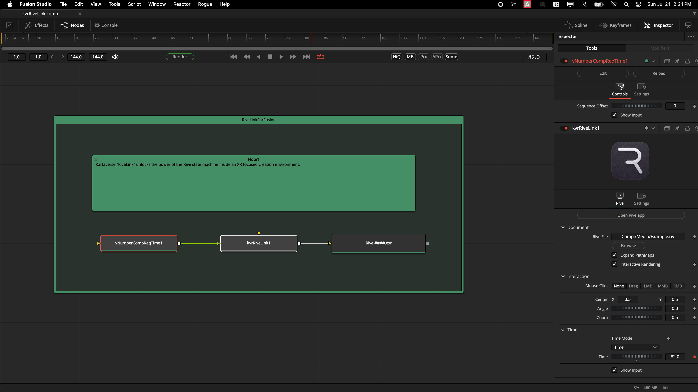
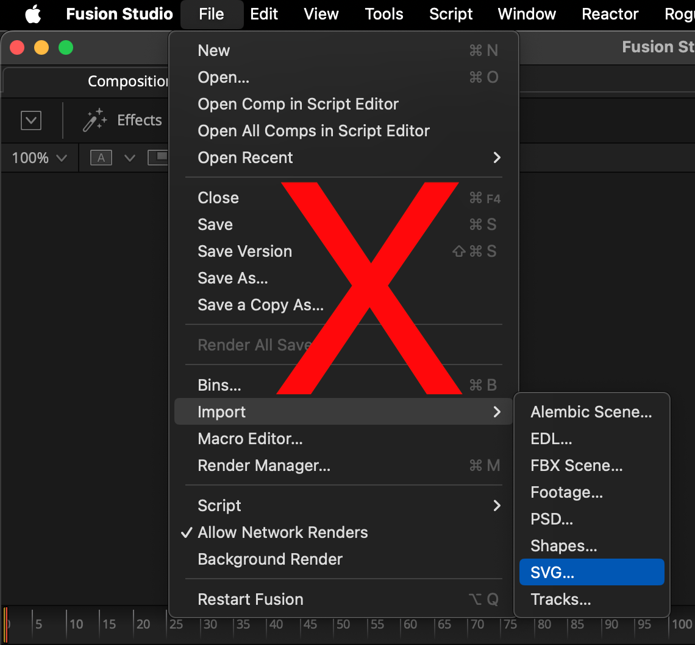

# RiveLink (WIP)

> The ultimate XR motion graphics solution for Fusioneers
>
> Enjoy!
>

Welcome to the development repo for "RiveLink" — a [Rive.app](https://rive.app/) integration plugin for BMD Resolve/Fusion. 

- The integration plugin was made in West Dover, Nova Scotia, Canada 🇨🇦

# Overview

With the RiveLink for Fusion data nodes you can effortlessly port your existing [Rive.app created](https://rive.app/features) motion graphics so they can work inside your favorite node based compositing toolset.

# No More SVGs in Fusion!

Finally, with the arrival of the interactive RiveLink rendering technology, artists can banish Fusion's legacy SVG graphics importing workflows that are kludgy, lack gradients and effects, and more than anything are needlessly complex and hard to maintain.

