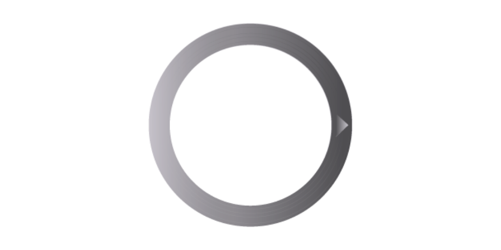
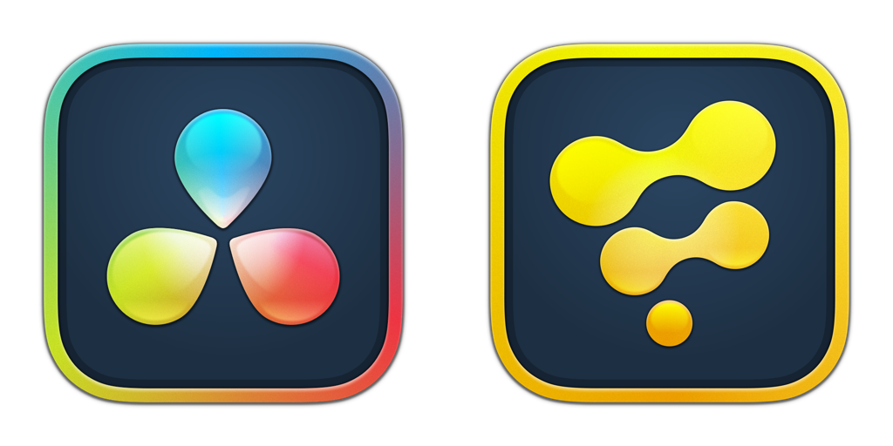

# RiveLink (WIP)

> The ultimate XR motion graphics solution for Fusioneers
>
> Enjoy!
>

Welcome to the development repo for "RiveLink" — a [Rive.app](https://rive.app/) integration plugin for BMD Resolve/Fusion. 

- The integration plugin was made in West Dover, Nova Scotia, Canada 🇨🇦

# Overview

With the RiveLink for Fusion data nodes you can effortlessly port your existing [Rive.app created](https://rive.app/features) motion graphics so they can work inside your favorite node based compositing toolset.

# No More SVGs in Fusion!

Finally, with the arrival of the interactive RiveLink rendering technology, artists can banish Fusion's legacy SVG graphics importing workflows that are kludgy, lack gradients and effects, and more than anything are needlessly complex and hard to maintain.

# Broad DCC Support Planned

The new Kartaverse RiveLink mograph toolset is being created with the goal of initially supporting Assimilate [Scratch](Assimilate Scratch/)/[LiveFX](https://www.assimilateinc.com/products/livefx/), BMD[Resolve](https://www.blackmagicdesign.com/products/davinciresolve)/[Fusion Studio](https://www.blackmagicdesign.com/products/fusion), and SideFX [Houdini Copernicus](https://www.sidefx.com/products/whats-new-in-h205/)  graphics software on Kartaverse 6's official launch day.

## Assimilate LiveFX Compatible

> `RiveLink for LiveFX` will be implemented as a native Assimilate Scratch [SPA plugin](https://www.assimilatesupport.com/akb/KnowledgebaseArticle50984.aspx). This allows RiveLink visuals to be rendered in realtime and displayed on an XR Stage LED video wall with multi-plane effects using LiveFX. 

(Special thanks goes out to Mazze Aderhold and Jeff at Assimilate for their support of the Kartaverse project. It is greatly appreciated!)

## BMD Resolve/Fusion Compatible

> `RiveLink for Resolve/Fusion` is a fuse that connects directly to the official [Rive-CPP](https://github.com/rive-app/rive-cpp) library, using the fuse API and its [LuaJIT FFI](https://luajit.org/ext_ffi.html) interface.

## SideFX Houdini Indie Compatible

> `RiveLink for Houdini Indie` will be implemented as a Houdini 20.5+ Copernicus node. Houdini's TOPs (Task Operator) automation environment can be used to batch render RiveLink motion graphics quickly with the help of the HQueue Render Manager.
