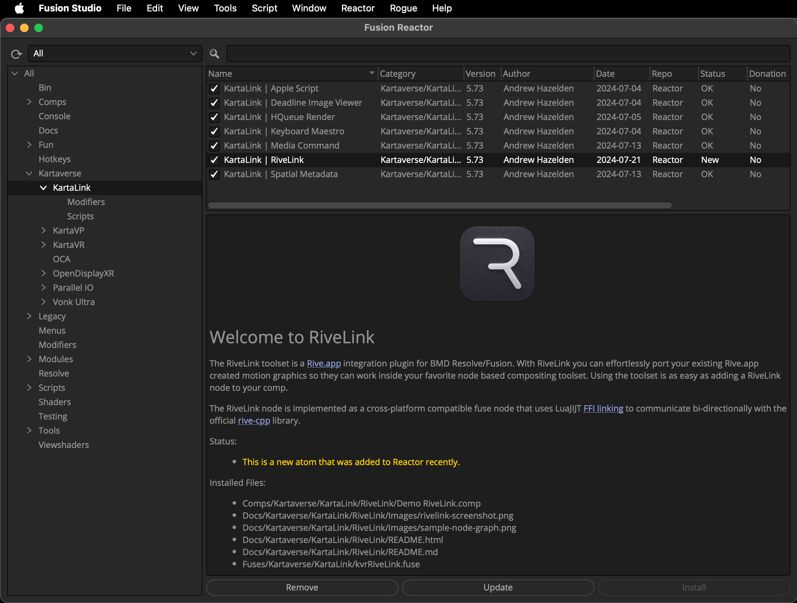

# RiveLink

> The ultimate XR motion graphics solution for Fusioneers
> Enjoy!
>

Welcome to the development repo for "RiveLink" — a [Rive.app](https://rive.app/) integration plugin for BMD Resolve/Fusion. 

With RiveLink you can effortlessly port your existing Rive.app created motion graphics so they can work inside your favorite node based compositing toolset.

- The integration plugin was made in West Dover, Nova Scotia, Canada 🇨🇦

___

Using the toolset is as easy as adding a RiveLink node to your comp. With only three nodes in your Fusion comp you are ready to output Rive.app animations to disk that are rendered at real-time FPS.

The RiveLink node is implemented as a cross-platform compatible fuse node that uses LuaJIJT [FFI linking](https://luajit.org/ext_ffi.html) to communicate bi-directionally with the official [rive-cpp](https://github.com/rive-app/rive-cpp) library.

___

## RiveLink Installation

The completed version of RiveLink will be delivered using the [Reactor Package Manager](https://kartaverse.github.io/Reactor-Docs/#/reactor) for Resolve/Fusion.

Installation is as easy as selecting the "Kartaverse/KartaLink" category on the left sidebar. Then click on the install checkbox next to the name of the "RiveLink" atom package.

