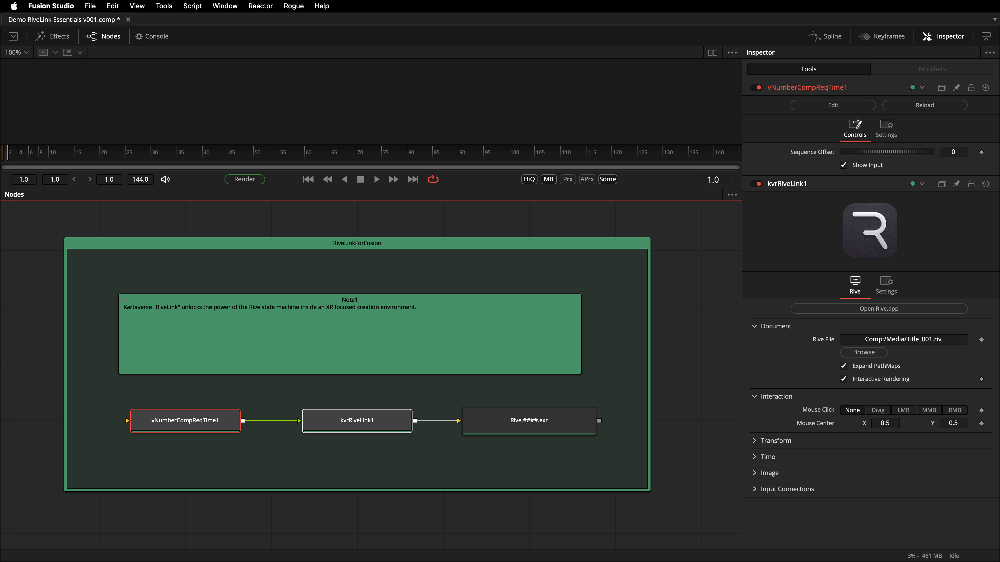

# RiveLink

> The ultimate XR motion graphics solution for Fusioneers
> Enjoy!
>

Welcome to the development repo for "RiveLink" — a [Rive.app](https://rive.app/) integration plugin for BMD Resolve/Fusion. 

With RiveLink you can effortlessly port your existing Rive.app created motion graphics so they can work inside your favorite node based compositing toolset.

- The integration plugin was made in West Dover, Nova Scotia, Canada 🇨🇦

___

Using the toolset is as easy as adding a RiveLink node to your comp. With only three nodes in your Fusion comp you are ready to output Rive.app animations to disk that are rendered at real-time FPS.

---

The RiveLink node is implemented as a cross-platform compatible fuse node that uses LuaJIJT [FFI linking](https://luajit.org/ext_ffi.html) to communicate bi-directionally with the official [rive-cpp](https://github.com/rive-app/rive-cpp) library.
