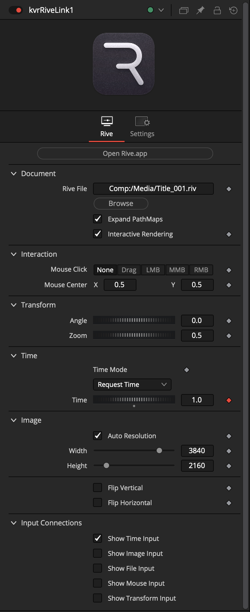
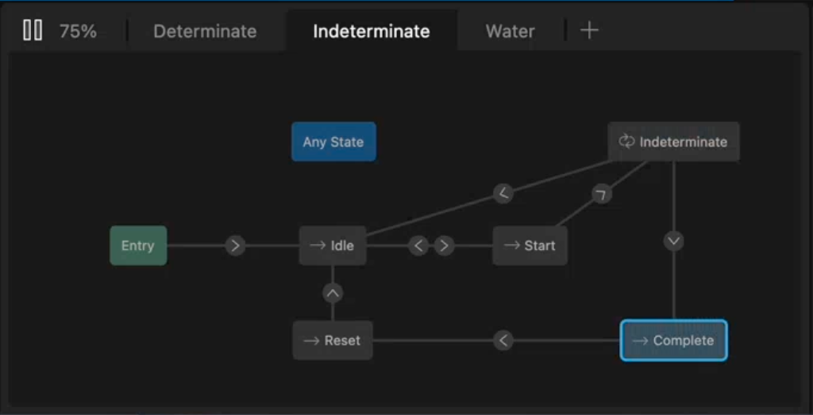
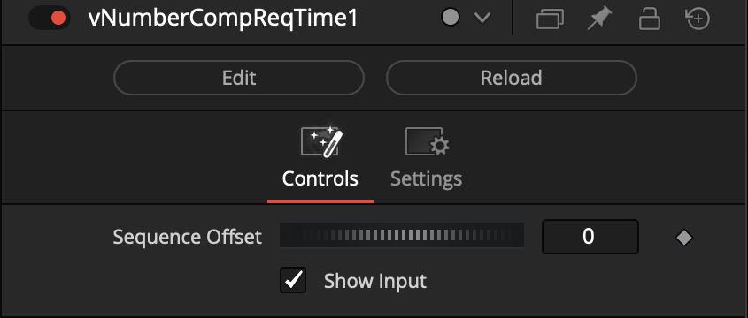

# RiveLink (WIP)

> The ultimate XR motion graphics solution for Fusioneers
> Enjoy!
>

Welcome to the development repo for "RiveLink" — a [Rive.app](https://rive.app/) integration plugin for BMD Resolve/Fusion. 

With RiveLink you can effortlessly port your existing Rive.app created motion graphics so they can work inside your favorite node based compositing toolset.

- The integration plugin was made in West Dover, Nova Scotia, Canada 🇨🇦

## Building Nodal Workflows

> Using this toolset is as easy as adding a "kvrRiveLink" node to your comp using the "Select Tool" dialog.

> Click on the "kvrRiveLink" node to select it in the Nodes view.

> Then with the RiveLink node visible in the Inspector panel, click on the "Browse" button to locate your .riv file. You can further customize the RiveLink settings to match your event timing, and final render resolution needs. 

>  Now you're in business and ready to render out motion graphics compositions! Click on Fusion Studio's "Render" button, located near the timeline playbar area, and Fusion will output your Rive.app based animation to disk.

If you are working on a new motion graphics element, and need to control the starting frame of the animation, you are ready to go with only three nodes in your Fusion comp:

		vNumberCompReqTime -> kvrRiveLink -> Saver/MediaOut

## Edit Page Effects Templates

The combined power of [Rive.app](https://rive.app/features) and RiveLink really shine when you place the "kvrRiveLink.fuse" node inside a custom Resolve Edit page "Effects Template" settings file. 

RiveLink even gives you access to live rendered motion graphics and titles on the Edit page of Resolve that don't require you to pre-render intermediate files to disk from After Effects! You can also add custom UserControls to your RiveLink based effects templates, too.

A nice thing about UserControls data is that it can be passed directly to the nodal operators that exist inside the [Rive.app state machine](https://help.rive.app/editor/state-machine). You can learn more about the [sate machine](https://rive.app/blog/state-machines-make-iteration-a-breeze-for-designers-and-developers) concept on the Rive blog.

The true power of RiveLink based title graphics is when you change the motion graphics defined in the original .riv file. Simply clearing the Resolve timeline cache for a project will result in all the RiveLink based tiles being updated at once. 

This is a lot simpler than having to revise dozens of Resolve title template macros and animated lower-thirds. This is especially true if you need to use the motion graphics elements in a long-term project where consistency can be hard to maintain across dozens of videos delivered in a variety of delivery formats, aspect ratios, and languages.

## No More SVGs in Fusion!

Finally, with the arrival of the interactive RiveLink rendering technology, artists can banish Fusion's legacy SVG graphics importing workflows that are kludgy, lack gradients and effects, and more than anything are needlessly complex and hard to maintain.

# Reactor Package Manager

## KartaLink | RiveLink Atom Package

When the RiveLink toolset is launched, as part of Kartaverse 6, it  will be delivered using the [Reactor Package Manager](https://kartaverse.github.io/Reactor-Docs/#/reactor) for Resolve/Fusion.

> Installation is as easy as selecting the "Kartaverse/KartaLink" category on the left sidebar. Then click on the ✅ checkbox to the left of the "KartaLink | RiveLink" atom package name to install it.

## Vonk Ultra Reactor Atom Package

> Vonk Ultra lets you take your motion graphics workflows to the next level!

Vonk makes it easy to use JSON/CSV files when you need to create data driven graphics.  These external data sources can pass bi-directional event messages to the Rive state machine in your comp. 

This data driven approach allows multiple node branches of RiveLink nodes in a comp to be kept perfectly sync so your .riv based animations playback with precise timing.

> When using RiveLink, it's helpful to also install the "Vonk Ultra" data node toolset from Reactor, too. Select the "Kartaverse/Vonk Ultra" category on the left sidebar. Then click on the ✅ checkbox to the left of the "Vonk Ultra" atom package name to install it.

# Using Vonk Based Temporal Effects

If want to do exotic things with your RiveLink node graphs, one of the most powerful free companion toolsets in Fusion, is the Vonk Ultra data nodes.

One of the many features of Vonk Ultra it that it gives you access to modifier nodes that peform temporal retiming of number datatypes. This number data can be sourced from keyframe animation curves, or a static value in the Inspector panel.

> The most frequently used Vonk "vNumber" based node is called `vNumberCompReqTime`. It works with number based dataype connections in the node graph and Inspector window. 

The `vNumberCompReqTime` node acts as a number modifier. This allows you to read a special version of the current timeline playhead position (time value), while also allowing you to apply extra layers of retiming effects to the node graph via the.

The `vNumberCompReqTime` node supports offsetting the current time value which makes it easy to adjust for things like a project specific `render start` frame number.

> Vonk's built-in number datatype based temporal editing nodes include `vNumberTimeSpeed` and `vNumberTimeStretch`.

> When a node is selected in the Nodes view, the Inspector panel's number, text, and point based input fields typically support the use of a "Connect To" approach. This is an alternative way to bind together nodes and is in some cases simpler to manage than constantly needing to code your own expressions.

Simply right-click over the input field. Then in the contextual menu navigate down to the "Connect To" section and select a node in the nnode graph that is compatible with that field's data type.

