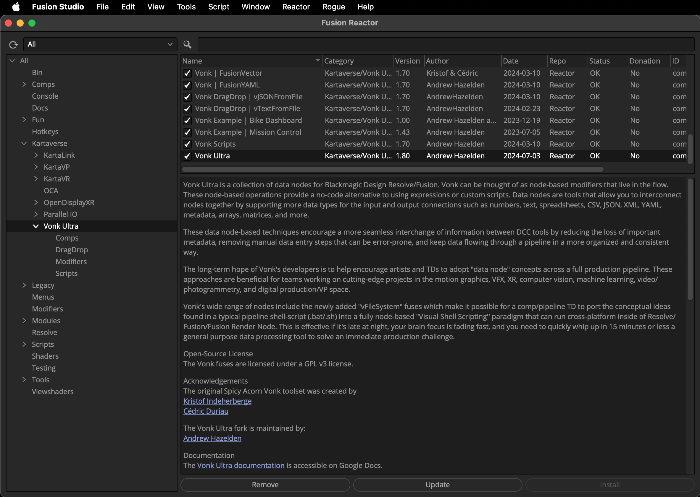

# BMD Resolve/Fusion Installation

## Reactor Package Manager

> To start using Kartaverse RiveLink for BMD Resolve/Fusion you [need to follow this guide](https://kartaverse.github.io/Reactor-Docs/#/reactor) to get the Reactor package manager setup on your system. 

For most users, it only takes a few minutes to get Reactor installed.

### What's a Package Manager?

Reactor is the package manager for BMD Resolve/Fusion. Reactor is maintained by a team of volunteers in the Fusion community. The package manager holds the macros, scripts, fuses, plugins, and example comps needed to take your compositing skills to the next level.

> Reactor content is sourced from the official [Reactor GitLab repository](https://gitlab.com/WeSuckLess/Reactor). This means you have to allow an outgoing firewall rule to the GitLab repository when you want to download new atom package updates. 

After you have Reactor installed, you might be interested to [browse a web based version](https://kartaverse.github.io/Reactor-Docs/) of the Reactor Package Manager content. This allows you to easily search through all the Reactor atom packages to find what you are looking for when you are on the go.

### KartaLink | RiveLink Atom Package

> Installation is as easy as selecting the "Kartaverse/KartaLink" category on the left sidebar. Then click on the ✅ checkbox to the left of the "KartaLink | RiveLink" atom package name to install it.

### Vonk Ultra Reactor Atom Package

> Vonk Ultra lets you take your motion graphics workflows to the next level!

Vonk makes it easy to use JSON/CSV files when you need to create data driven graphics.  These external data sources can pass bi-directional event messages to the Rive state machine in your comp. 

This data driven approach allows multiple node branches of RiveLink nodes in a comp to be kept perfectly sync so your .riv based animations playback with precise timing.

> When using RiveLink, it's helpful to also install the "Vonk Ultra" data node toolset from Reactor, too. Select the "Kartaverse/Vonk Ultra" category on the left sidebar. Then click on the ✅ checkbox to the left of the "Vonk Ultra" atom package name to install it.

