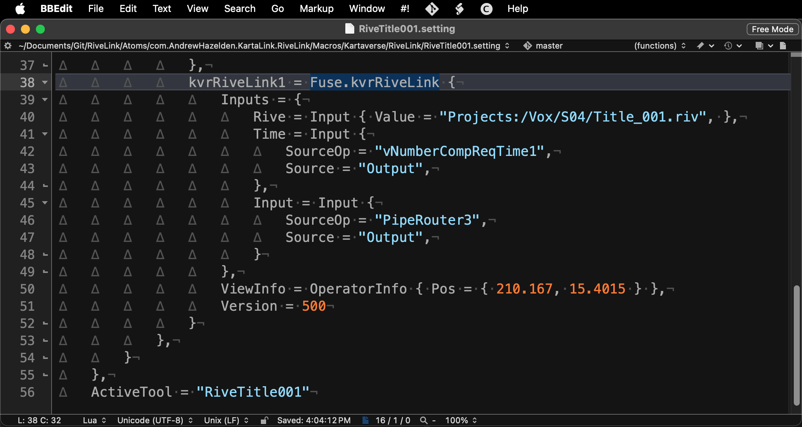
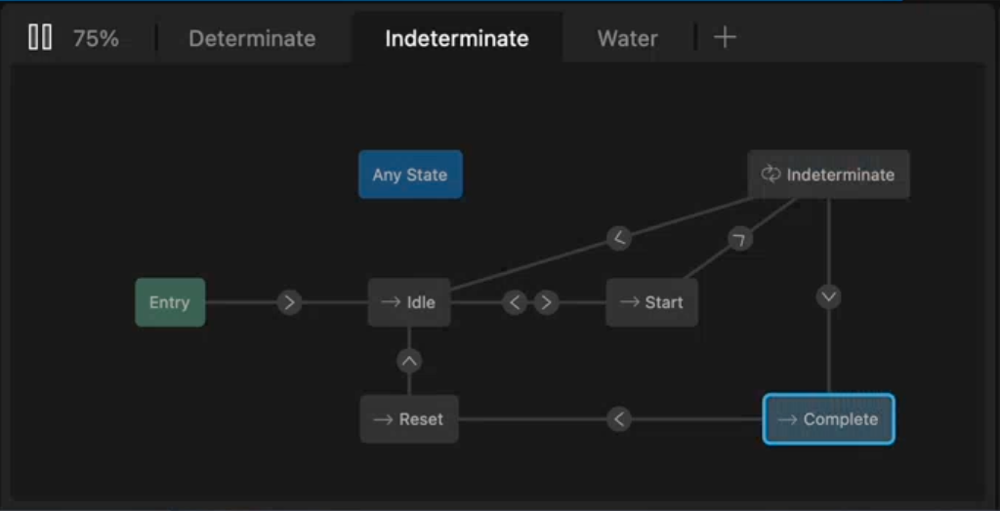

# Edit Page Effects Templates

The combined power of [Rive.app](https://rive.app/features) and RiveLink really shine when you place the "kvrRiveLink.fuse" node inside a custom Resolve Edit page "Effects Template" settings file. 

RiveLink even gives you access to live rendered motion graphics and titles on the Edit page of Resolve that don't require you to pre-render intermediate files to disk from After Effects! You can also add custom UserControls to your RiveLink based effects templates, too.

A nice thing about UserControls data is that it can be passed directly to the nodal operators that exist inside the [Rive.app state machine](https://help.rive.app/editor/state-machine). You can learn more about the [sate machine](https://rive.app/blog/state-machines-make-iteration-a-breeze-for-designers-and-developers) concept on the Rive blog.

The true power of RiveLink based title graphics is when you change the motion graphics defined in the original .riv file. Simply clearing the Resolve timeline cache for a project will result in all the RiveLink based tiles being updated at once. 

This is a lot simpler than having to revise dozens of Resolve title template macros and animated lower-thirds. This is especially true if you need to use the motion graphics elements in a long-term project where consistency can be hard to maintain across dozens of videos delivered in a variety of delivery formats, aspect ratios, and languages.
