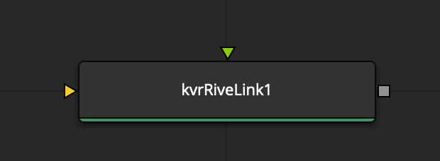

# Building Nodal Workflows

## Adding your first RiveLink node

Using the RiveLink toolset is as easy as adding a new "kvrRiveLink" node to your comp. 

> The Fusion page's "Select Tool" dialog is displayed by pressing the Shift+Space (macOS) or Control+Space (Windows/Linux) hotkey combination.

> In the Nodes view, click on the "kvrRiveLink" node to select it.

## Customize the Parameters

> With the RiveLink node visible in the Inspector panel, click on the "Browse" button to locate your .riv file.

You can further customize the RiveLink settings to match your event timing, and final render resolution needs. 

>  Now you're in business and ready to render out motion graphics compositions! Click on Fusion Studio's "Render" button, located near the timeline playbar area, and Fusion will output your Rive.app based animation to disk.

## Your First Node Graph

A typical Rive based motion graphics node graph starts with addition of three nodes to your Fusion comp:

		vNumberCompReqTime -> kvrRiveLink -> Saver/MediaOut

> These inital nodes make a great starting point for a new RiveLink nodegraph. They are simple, yet give you the ability to customize the timing of the animation.

After you deeper into RiveLink you can start to interact directly with the Rive state machine using vNumber data nodes that are provided by the Vonk Ultra package in Reactor.

