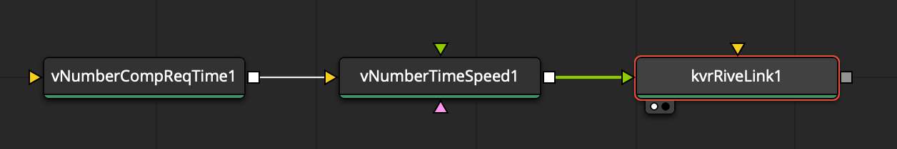
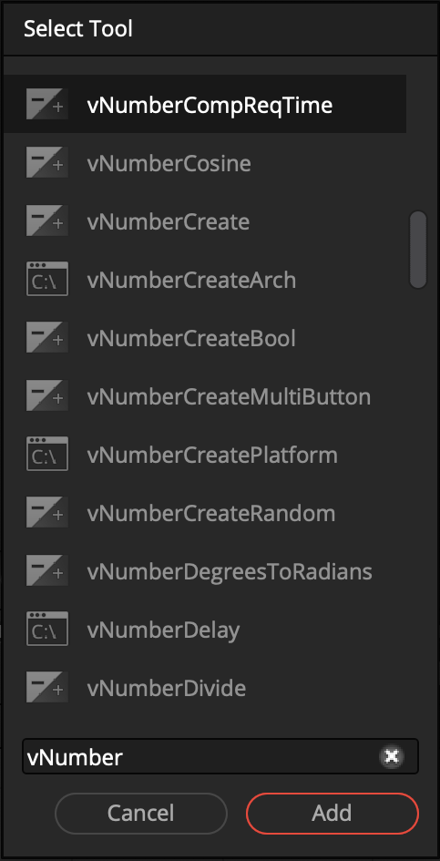
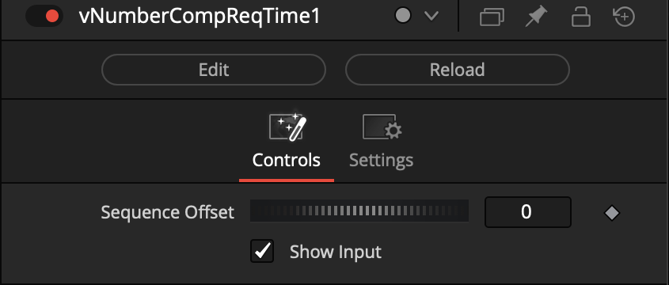
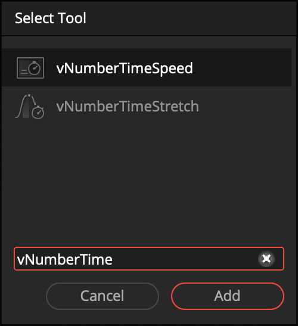
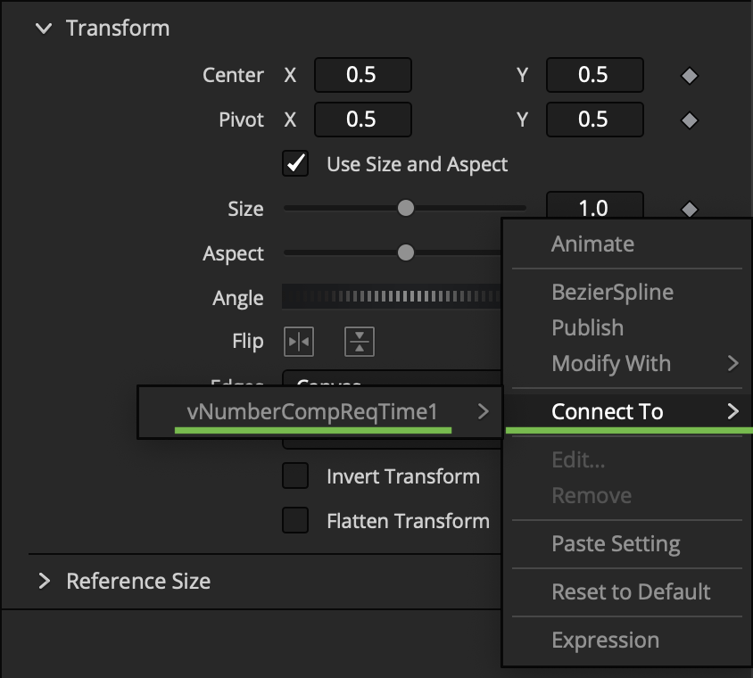

# Using Vonk Based Temporal Effects

If want to do exotic things with your RiveLink node graphs, one of the most powerful free companion toolsets in Fusion, is the Vonk Ultra data nodes.

One of the many features of Vonk Ultra it that it gives you access to modifier nodes that peform temporal retiming of number datatypes. This number data can be sourced from keyframe animation curves, or a static value in the Inspector panel.

> The most frequently used Vonk "vNumber" based node is called `vNumberCompReqTime`. It works with number based dataype connections in the node graph and Inspector window. 

The `vNumberCompReqTime` node acts as a number modifier. This allows you to read a special version of the current timeline playhead position (time value), while also allowing you to apply extra layers of retiming effects to the node graph via the.

The `vNumberCompReqTime` node supports offsetting the current time value which makes it easy to adjust for things like a project specific `render start` frame number.

> Vonk's built-in number datatype based temporal editing nodes include `vNumberTimeSpeed` and `vNumberTimeStretch`.

> When a node is selected in the Nodes view, the Inspector panel's number, text, and point based input fields typically support the use of a "Connect To" approach. This is an alternative way to bind together nodes and is in some cases simpler to manage than constantly needing to code your own expressions.

Simply right-click over the input field. Then in the contextual menu navigate down to the "Connect To" section and select a node in the nnode graph that is compatible with that field's data type.

