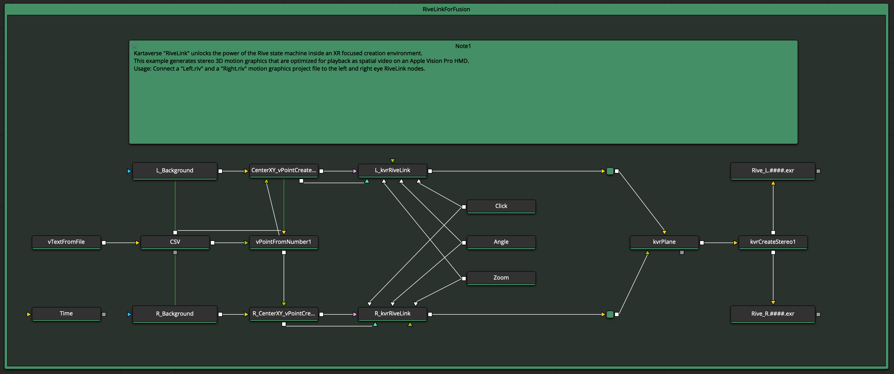
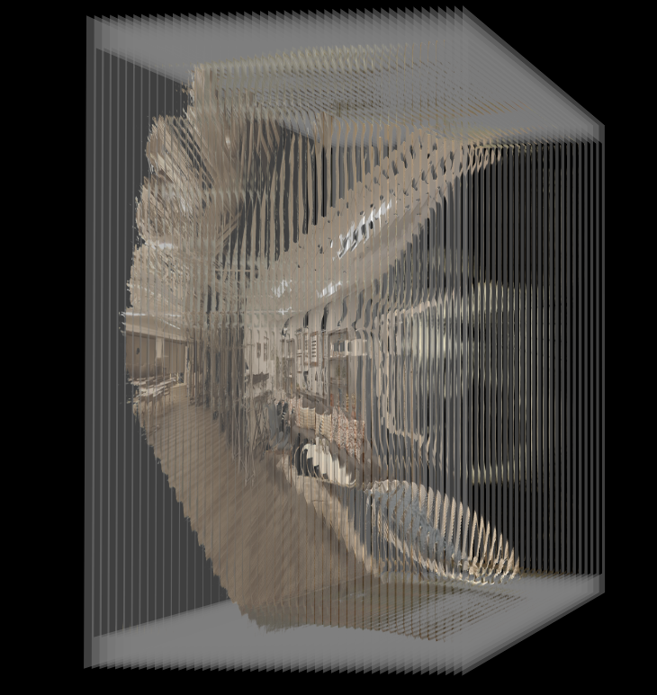
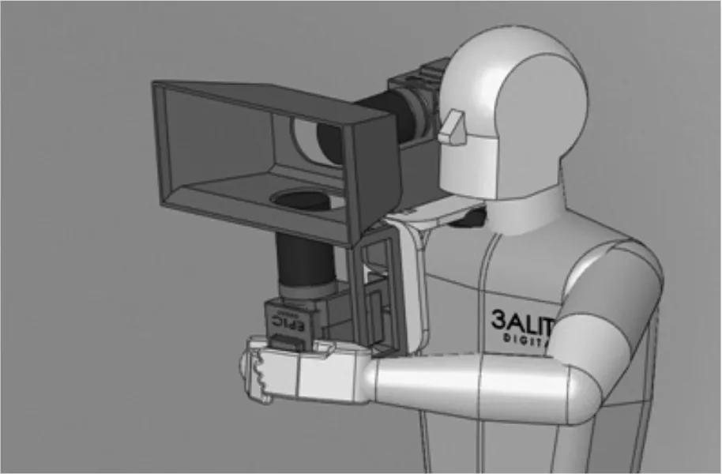

# XR Motion Graphics

> RiveLink is designed with the specific needs of XR artists in mind.

The RiveLink integration plugin offers XR artists a toolset that allows 6DoF spatial content creators, and virtual production stages to rapidly generate beautiful XR focused motion graphics.

With RiveLink and the Kartaverse [DCTL fuse nodes](https://kartaverse.github.io/Kartaverse-Docs/#/fuses) you can to insert a pair of left and right eye Rive ([.riv](https://rive.app/community/doc/format/docxcTF9lJxR)) formatted motion graphics visuals into an immersive scene, and attach the media to X/Y, 3DoF (rotation), or 6DoF (rotation and translation) compatible point tracking locators.

## 2.5D Matte Painting Workflows

RiveLink is an ideal choice if you are running 2.5D matte painting workflows on your virtual production stage and you want to rapidly generate XR focused motion graphics that are z-depth distance aware with interactive parallax shifts based upon camera tracking metadata.

Layered depth image '"tacks" can use a variety of geometries support the playback of a 6DoF scene without using a high polygon count geometry.

> The following image shows a Google [Deep-View](https://github.com/AndrewHazelden/DeepViewer) sample image that illustrates what a depth-sliced version of a volumetric scene looks like from an off-axis perspective. 

If a VAD (Virtual Art Department) is working on a VP LED stage, and they need to deliver fast-turn around motion graphics, that look brilliant at ultra-high resolution, then an unbeatable combination would be to use [Assimilate LiveFX](https://www.assimilateinc.com/products/livefx/), the [Rive Editor](https://rive.app/editor), and the upcoming Kartaverse RiveLink SPA plugin.

If your VP stage supports Brompton-style "[Frame Remapping](https://www.bromptontech.com/features/frameremapping/)" aka. "[Ghost Frame](https://megapixelvr.com/ghostframe/)" like workflows, that use interleaved image playback at a high frame rate, then are you are in for a treat: 

> With RiveLink's integrated MV (multi-view) support you will be able to playback different Rive (.riv) motion graphics visuals to the LED wall screen that can be uniquely isolated and seen by Camera A, and Camera B. 

This multi-view rendering support allows stereoscopic 3D motion graphics to happen on a VP stage, all you need is Frame Remapping and to have a Beamsplitter rig attached to your production cameras.

